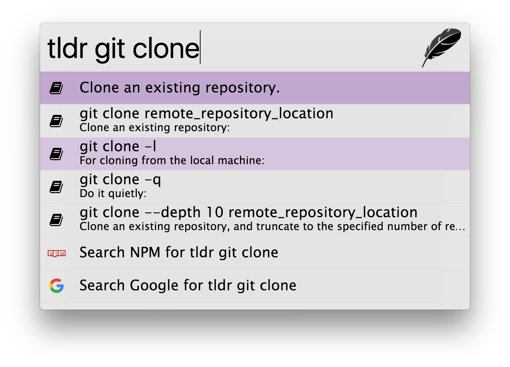

## tldr for Zazu

Make [`tldr`](https://tldr-pages.github.io/)  easier to use with [Zazu](http://zazuapp.org/).

### Usage

Simply type `tldr` and `space`, then follow by the command you want to check.

### Installing

Add the package to your plugins array in `./zazurc.js`.

'twang2218/zazu-tldr'
